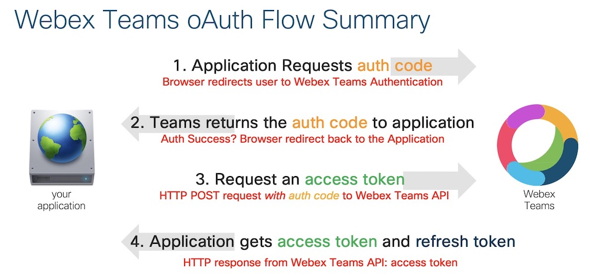

# Webex-Teams-Flask-oAuth
Example code of Python with Flask to do Webex Teams authentication using oAuth
This example uses Flask, a tiny webserver in Python.

# Start 
1. [Prepare](#1prepare)
2. [Create Webex Teams Integration](#2create) (oAuth)
3. [Update script](#3updatecode)
4. [Run script](#4startcode)
5. [Tips](#tips)
6. [Next](#next)
[How does oAuth work?](#how)

<a name="1prepare"/>

# 1. Prepare
1. [Download](https://www.python.org/downloads/) & Install Python 3.6 or higher
2. [Install Flask](http://flask.pocoo.org/docs/1.0/installation/): [system wide](http://flask.pocoo.org/docs/1.0/installation/#install-flask) or in a 
[virtual environment](http://flask.pocoo.org/docs/1.0/installation/#virtual-environments) (if you don't know what that is, ignore it)
3. Test your setup: type "Python -V" and check the version number. 
	- version >3.6 or higher: continue
	- version <3.6: try again with "Python3 -V"
4. In Python type "import flask" and press enter. If there's no error message, continue, otherwise troubleshoot.

In case you're wondering: [how does oauth work?](#how)

<a name="2create"/>

# 2. Create Teams integration

1. https://developer.webex.com
2. Login 
3. "My Webex Teams Apps" (click your Avatar on the top right)
4. Create a New App
5. Integration
  1. Integration name: pick a useful and descriptive name
  2. Contact email: your account email
  3. Icon: select one
  4. Description: tell yourself what you are testing
  5. Redirect URI: the URL that Webex Teams needs to go to when you authenticated succesfully 
  (most likely http://127.0.0.1:5000)
  6. Scopes: spark:people_read
  7. Add integration

<a name="3updatecode"/>

# 3. Update Code

1. With the new integration in place, copy the Client_Id and Client_Secret (be careful that you don't confuse 
these with the 'Integration ID' that's also displayed!)
2. Open the Python script and paste the Client_Id and Client_Secret in the variables.

<a name="4startcode"/>

# 4. Start Code
1. In a terminal window (or command prompt), go to the folder that contains your script
2. Run the script "Python python-oauth.py"  (or "Python3" if you also have Python v2)
3. You should see Flask starting and waiting to work
4. Open a browser and go to http://127.0.0.1:5000
5. Click "here" to login and see what happens.

<a name="tips"/>

# Tips

- Mac users: use the [Atom editor](https://atom.io/) and make sure it has Python syntax highlighting
   (BTW, one of my favourite packages is "highlight-selected")
- Windows users: [Notepad++](https://notepad-plus-plus.org/download/v7.7.html) 

<a name="next"/>

# Next

**Take a look at the code!** I've tried to keep it as simple as possible. When reading it you should be able to understand what's happening and which steps are taken. Also look at the oAuth flow image below
**Look at** these other resources:
- [Awesome Webex](https://github.com/CiscoDevNet/awesome-webex) Github page
- [Learning Labs](https://learninglabs.cisco.com) Fantastic online labs

<a name="how"/>

# How does oAuth work?

I've taken one of the summary slides from my oAuth presentations. 

&nbsp;&nbsp;&nbsp;&nbsp;&nbsp;&nbsp;&nbsp;&nbsp;&nbsp;&nbsp;&nbsp;&nbsp;&nbsp;&nbsp;&nbsp;&nbsp;&nbsp;&nbsp;&nbsp;&nbsp;&nbsp;&nbsp;&nbsp;&nbsp;&nbsp;          

Enjoy!
DJ

